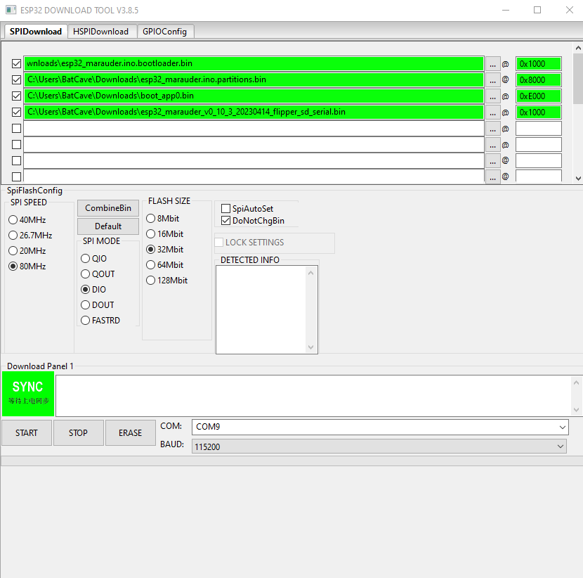

# Flipper-WifiDevKit-ESP32

#Tingel tangel
https://github.com/UberGuidoZ/Flipper/tree/main/Wifi_DevBoard/FZ_Marauder_Flasher

#TODO
* Map til pin connection 
* Til links https://www.electronicshub.org/esp32-pinout/
* Rouge master / unleashed firmware til flipper som gør brug af maruader nemt via flipper gui

#Marauder Setup

Firstly install this driver so that the module will be recognized by the pc(https://www.silabs.com/developers/usb-to-uart-bridge-vcp-drivers?tab=downloads)

* From https://github.com/justcallmekoko/ESP32Marauder/releases/ , download the latest version of maruader(esp32_maruader_flipper_sd_seriel).

* Then go to  https://github.com/justcallmekoko/ESP32Marauder/wiki/update-firmware , where you should get the Bootloader, Partitions and Boot App for the Flipper zero wifi Dev Board.

|                |  |
|----------------|--|
|                |  |  
|                |  |
|                |  |

Next 
* Next your gonna need to flash these to the ESP-32, this is done through this site(https://esp.huhn.me/) , with the Arduino IDE(https://www.arduino.cc/en/software) or with the program from this repository(https://github.com/martinloren/HScope) .

**If you use the web tool(https://esp.huhn.me/) , these are the steps to flash the device** 
    

**If you use the arduino IDE(https://www.arduino.cc/en/software) , these are the steps to flash device(Note that there are different steps for v1 and v2 of the IDE, but this will cover the steps for Arduino IDE V2.0)**

**If you use the tools from (https://github.com/martinloren/HScope) **

**Links used for the project:**

* Flipper Zero Schematics(https://docs.flipperzero.one/development/hardware/schematic)
* First start WifiDev Module(https://docs.flipperzero.one/development/hardware/wifi-debugger-module/first-start)
* Datasheet for the ESP-32-Wroom-32(https://www.espressif.com/sites/default/files/documentation/esp32-wroom-32_datasheet_en.pdf)
* Info for ESP-32-wroom-32(https://electropeak.com/learn/full-guide-to-esp32-pinout-reference-what-gpio-pins-should-we-use/)
* Documentation for Flipper GPIO & modules (https://docs.flipperzero.one/gpio-and-modules)

#RougeMaster Setup for Flipper Zero
