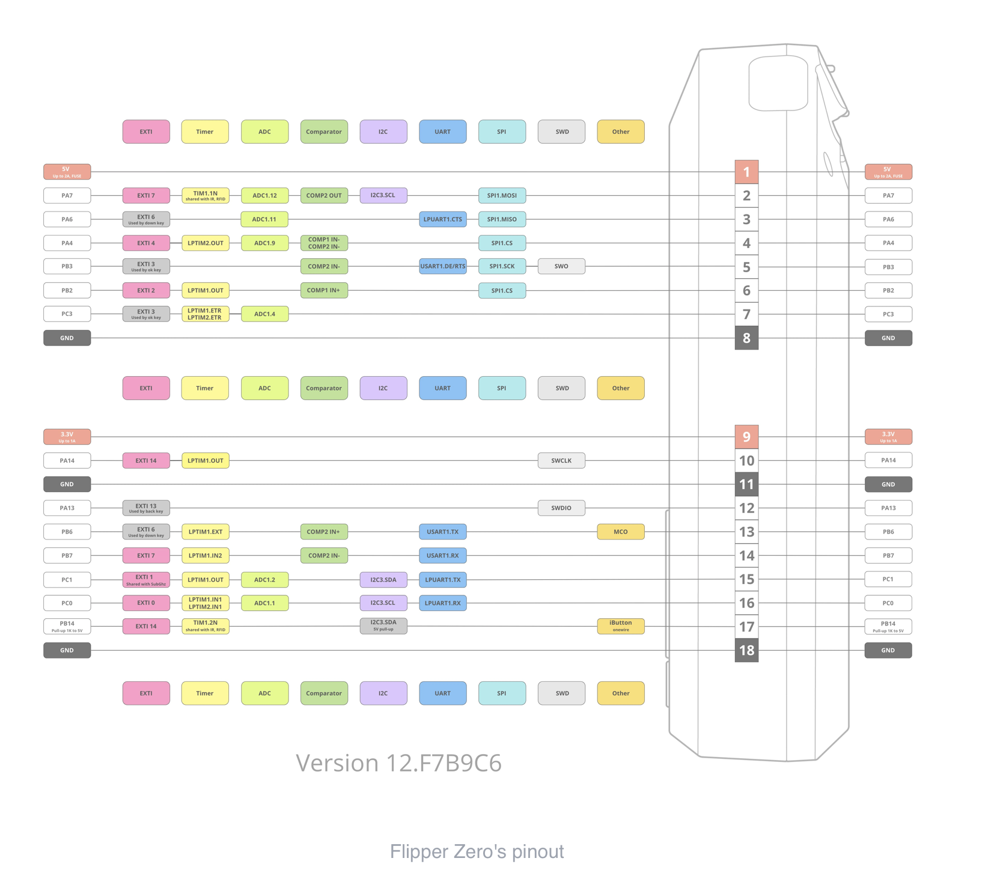

# Flipper-WifiDevKit-ESP32

#TODO
* Map til pin connection
* Bedre pinout til esp32 
* Til links https://www.electronicshub.org/esp32-pinout/

#Marauder Setup

* From https://github.com/justcallmekoko/ESP32Marauder/releases/ , download the latest version of maruader(esp32_maruader_flipper_sd_seriel).

* Go to  https://github.com/justcallmekoko/ESP32Marauder/wiki/update-firmware , where you should get the Bootloader, Partitions and Boot App for the Flipper zero wifi Dev Board.

* Next your gonna need to flash these to the ESP-32, this is done through this site(https://esp.huhn.me/) , with the Arduino IDE(https://www.arduino.cc/en/software) or with the program from this site(https://www.martinloren.com/how-to/fashing-esp32/) .

**If you use the web tool(https://esp.huhn.me/) , these are the steps to flash the device** 
    

**If you use the arduino IDE(https://www.arduino.cc/en/software) , these are the steps to flash device(Note that there are different steps for v1 and v2 of the IDE, but this will cover the steps for Arduino IDE V2.0)**

**If you use the tool from (https://www.martinloren.com/how-to/fashing-esp32/) , **

**Links used for the project:**

* Flipper Zero Schematics(https://docs.flipperzero.one/development/hardware/schematic)
* First start WifiDev Module(https://docs.flipperzero.one/development/hardware/wifi-debugger-module/first-start)
* Datasheet for the ESP-32-Wroom-32(https://www.espressif.com/sites/default/files/documentation/esp32-wroom-32_datasheet_en.pdf)
* Info for ESP-32-wroom-32(https://electropeak.com/learn/full-guide-to-esp32-pinout-reference-what-gpio-pins-should-we-use/)
* Documentation for Flipper GPIO & modules (https://docs.flipperzero.one/gpio-and-modules)
